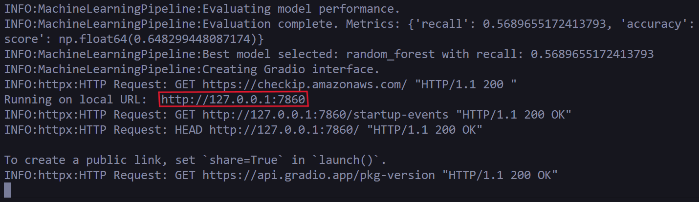
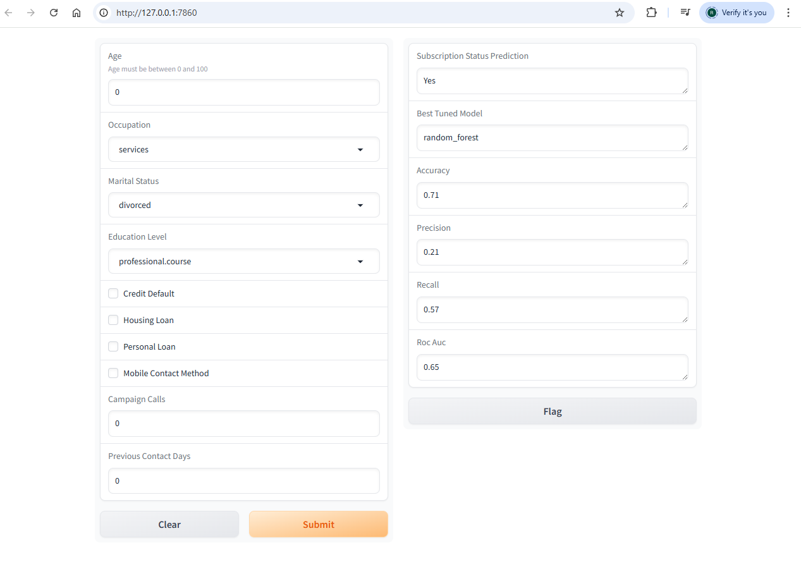

# aiap20-raymond-bala-036D
Name: Raymond Bala <br>
NRIC: S9936036D


## File Structure
<pre> <code>
📂 /github       📂 /workflows
├────────├────────├ workflows├── github-actions.yml
📂 /images 
├────────├── ...
📂 /src 
├────────├── MachineLearningPipeline.py 🗜️
│        ├── main.py
│        └── config.yaml ⚙️
├── .gitignore
├── README.md 👀
├── requirements.txt
└── run.sh 🏃</code> </pre>

Basic explanation for each file
- github-actions.yml <br>
  Stores config for CI/CD platform for automating tests and deployment
- MachineLearningPipeline.py <br>
  Source code for MachineLearningPipeline module
- main.py <br>
  Contains driver code for running the machine learning pipeline
- config.yaml <br>
  Contains basic configuration for the pipeline
- .gitignore <br>
  Untrack listed local files 
- README.md <br>
  Contains essential information about project
- requirements.txt <br>
  List of packages needed to run the pipeline
- run.sh <br>
  Executable bash script for running the machine learning pipeline

## Instructions
1. Install the required libraries using the following command. **Only required when running the pipeline for the first time**
```cmd
pip install -r requirements.txt
```
3. Create a folder named data at the root of the directory. Insert the database into this folder.
4. Configure settings in config.yaml. Ensure the paths to the database and configuration file are correct.
Other parameters you may wish to modify in the settings are
- test_size: How much of the data you want to test on, the rest is used for training
- random_state: Ensures consistent and reproduceable results when attempting multiple runs
- features: You may choose to drop a feature by removing it from feature column

6. Run the bash script run.sh
7. A link will be provided. Click on the link and you will be directed to a model inference interface where you can query the best model.
Each successful query will return the result of whether the model predicts the user will subscribe or not, along with the model name and metrics
(accuracy,precision,recall,roc_auc)

Result on command line
Note: Click on the link highlighted by the red box


Gradio Interface after a successful query is run.


Note: Warnings are to be expected when running the pipeline. This is normal and will not affect the pipeline or the results.

## Outline of Machine Learning Pipeline <br>
There are two main classes in the pipeline. The classes are 
- Preprocess
- ModelTrainer

Both classes need to be initialised with the configuration of type Dict.

### Preprocess

1. Reads data
2. Cleans data <br>
   More explanation provided under Data Processing
3. Creates preprocessor <br>
   All nan values are imputed with majority value <br>
   Numerical categories are scaled (Age,Campaign Calls) <br>
   Education Level is ordinal encoded <br>
   Occupation and Marital Status is one-hot encoded <br>

### ModelTrainer
1. Splits data into training and testing sets
2. Base models (no hyperparameters) are trained and evaluated
3. Hyperparameters are tuned
4. Gradio interface created


## Data Processing 


| Feature    | Processing |
| -------- | ------- |
| Client ID  | Feature is dropped   |
| Age  | Convert from text to float <br> replace value 150 with nan   |
| Occupation | replace unknown with nan     |
| Marital Status    | replace unknown with nan   |
| Education Level  | replace unknown with nan    |
| Credit Default | mapping as follows <br> yes -> 1 <br> no -> 0 <br> replace unknown with nan     |
| Housing Loan    | mapping as follows <br> yes -> 1 <br> no -> 0 <br> replace unknown, None with nan    |
| Personal Loan  |  mapping as follows <br> yes -> 1 <br> no -> 0 <br> replace unknown, None with nan    |
| Contact Method | mapping as follows <br> telephone -> 1 <br> Telephone  -> 1 <br>  Cell -> 0 <br> cellular  -> 0 <br>     |
| Campaign Calls  | convert to absolute value    |
| Contact Made  |  New feature extracted from Previous Contact Days <br> 999 days -> 0 else 1 <br> Feature Previous Contact Days dropped   |
| Subscription Status  |  mapping as follows <br> yes -> 1 <br> no -> 0    |


## Models

The following models and the reason for using them are listed

- K Nearest Neighbor <br>
Easy to interpret and understand. Looks at nearby features to make predictions.

- Random Forest <br>
Can handle numerical and categorical features well. Can learn non linear features well. 

- Support Vector Machine <br> 
Performs well in high dimensional space to find clear margin of separation. Can find hyperplane with maximum margin
which improves generalisation.

- XGBoost <br>
It is state of the art model for tabular data. It uses an ensemble of weak learners sequentially. Each subsequent
tree corrects the errors of the previous tree.

## Metrics

We use precision, accuracy, recall and roc_auc score.

Precision is how many true positives divided by sum of true positive and false positives.
Recall is how many true positives divided by sum of true positive and false negatives.
Accuracy is how many test samples were predicted correctly.
Roc Auc score summarises machine learning models performance across various thresholds.
These metrics help us to select a model that avoids costly mistakes while ensuring the model performance well overall. 

Parameters are tuned to increase the precision score. Recall formula is as follows. <br>

Recall = TP / (TP + FN)

Recall is an important metric here because we want to identify as many potential subscribers. Missing a client who could have been
a potential subscriber (False Negative) is more costly than missing a client predicted to subscribe but does not subscribe (False Positive).

Tuned SVM is giving us the best results based on recall.

| Metrics | Baseline XGB | Baseline KNN | Baseline Random Forest | 
| --- | --- | --- | --- | 
| Precision | 0.39 | 0.21 | 0.28 | 
| Accuracy | 0.87 | 0.77 | 0.84 | 
| Recall | 0.27 | 0.37 | 0.28 | 
| Roc Auc | 0.61 | 0.60 | 0.60 | 

| Metrics | Tuned XGB | Tuned KNN | Tuned Random Forest | Tuned SVM |
| --- | --- | --- | --- | --- |
| Precision | 0.39 | 0.22 | 0.19 | 0.19 |
| Accuracy | 0.87 | 0.80 | 0.67 | 0.67 |
| Recall | 0.29 | 0.37 | 0.58 | 0.63 |
| Roc Auc | 0.61 | 0.59 | 0.63 | 0.65 |


Assumptions <br>
I assume the following ranking for Education Status in ascending order.<br>
```
illiterate -> basic.4y -> basic.6y -> basic.9y -> high.school -> preofessional.course -> university.degree
```
There are negative number of campaign calls. I assume that they are meant to be positive but was mistakenly entered in as negative.

## Findings from Exploratory Data Analysis

There is class imbalance. 89% of individuals subscribed, 11% did not.

Age distribution of those who subscribed and did not subscribe are roughly the same. There are some outliers of age 150.

There are 11 different categories of occupation.
student,unemployed,housemaid,self-employed,entrepreneur,retired,management,services,technician,blue-collar,admin. Most individuals are either admin or blue-collar.

Most individuals are married.

Most individuals have either university degree or high school diploma.

Most individuals did not default on their credit.

There is an almost equal split of individuals with and without housing loan.

Most individuals do not have personal loan.

Most individuals contacted via mobile phone.

The distribution of campaign calls follows a geometric distribution. The number of calls decreases exponentially with time.

Most individuals have not been contacted before.


